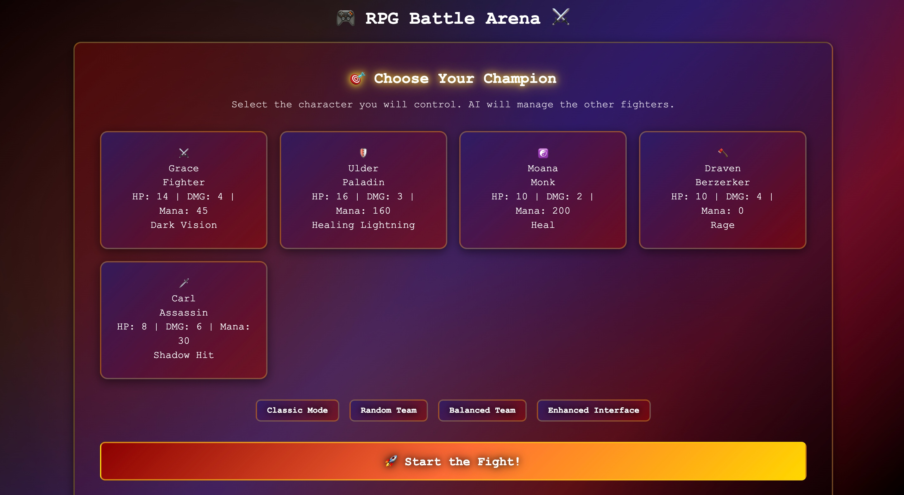
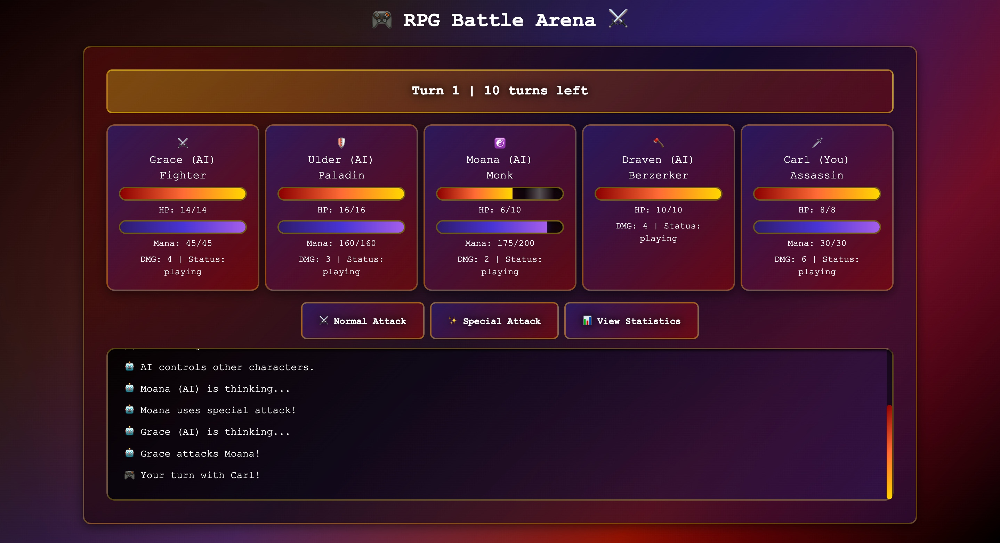
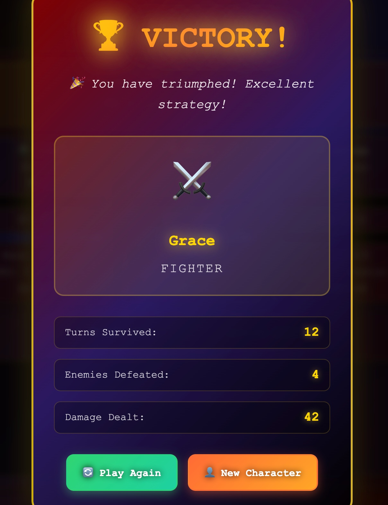
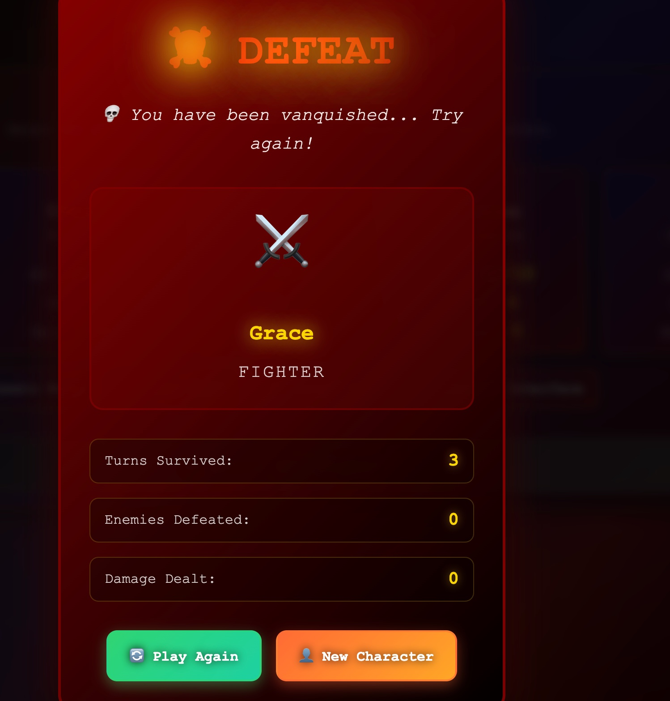
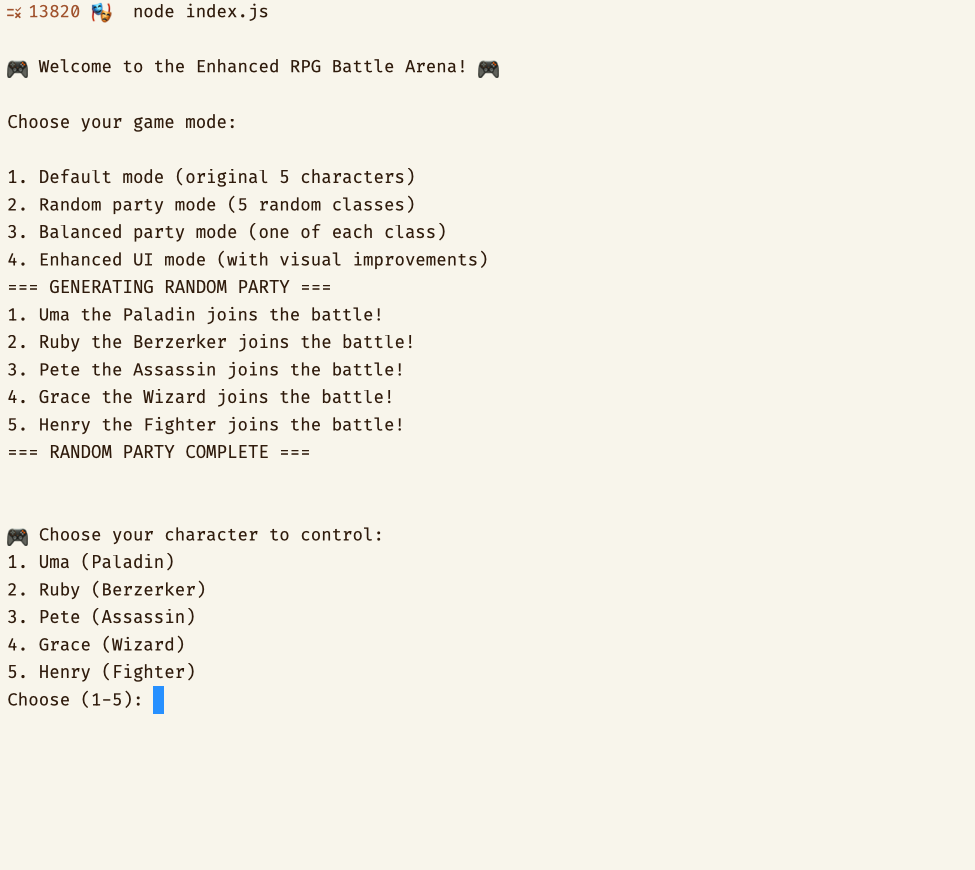
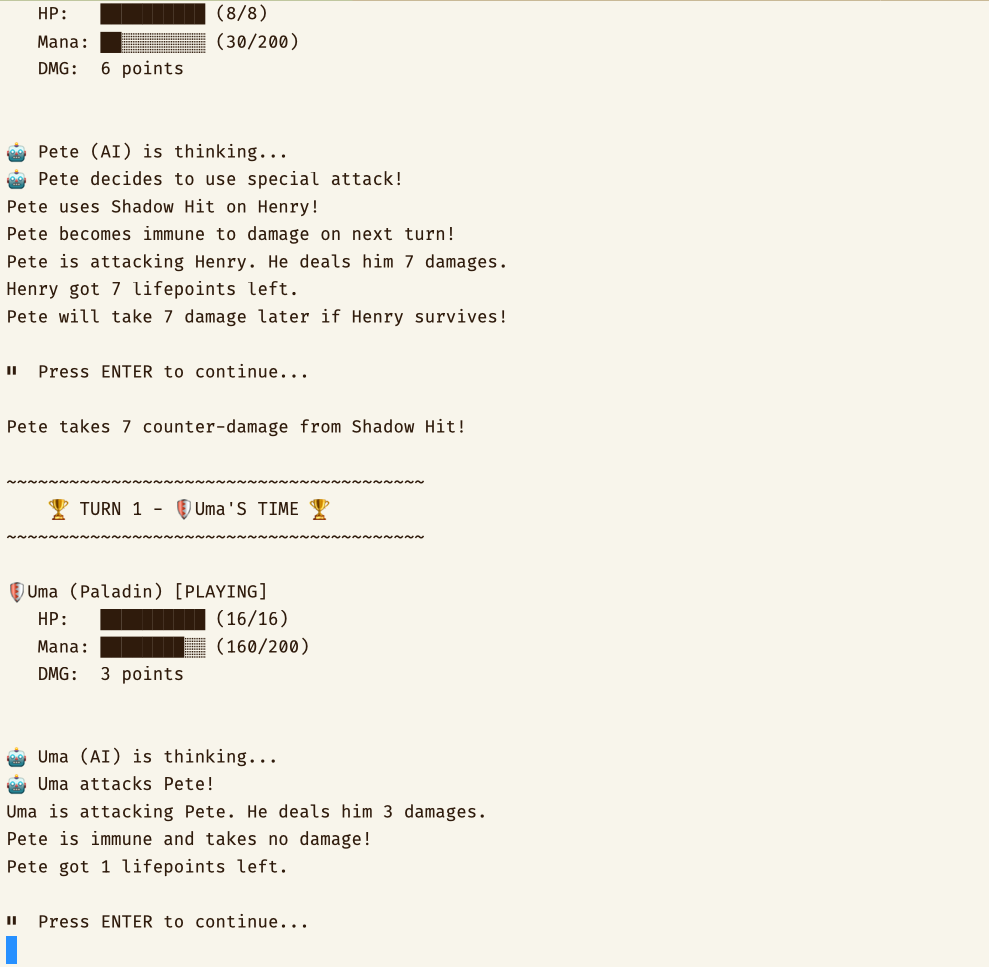

# 🎮 JavaScript RPG Battle Arena

A turn-based RPG game featuring 7 unique character classes battling to the death in an arena setting. Available in both **terminal** and **web** versions with identical gameplay mechanics.

## 🚀 Features

- **Dual Platform**: Terminal console and web browser versions
- **7 Character Classes**: Fighter, Paladin, Monk, Berserker, Assassin, Wizard, Valkyrie
- **Multiple Game Modes**: Classic, Random Team, Balanced Team, Enhanced Interface
- **Enhanced UI**: Visual health/mana bars with class icons (web version)
- **Strategic Combat**: Each class has unique abilities and playstyles
- **Turn-based Gameplay**: 10-turn limit with victory conditions
- **Interactive Controls**: Player-controlled actions with AI opponents
- **Mortal Kombat Styling**: Dark theme with gold accents (web version)

## 📦 Installation

```bash
# Clone or download the project
cd Js_RPG_Term-localhost

# Install dependencies (optional - for SCSS compilation)
npm install

# Run terminal version
npm run terminal
# OR
node index.js

# Run web version (REQUIRES HTTP SERVER)
npm run web                 # Starts server on port 8000
npm run web:open           # Opens browser to localhost:8000

# Alternative web setup
python3 -m http.server 8000
# Then open: http://localhost:8000

# ⚠️  IMPORTANT: Web version requires HTTP server

# Compile SCSS (if making style changes)
npm run build
```

## 📸 Screenshots

### Web Version


_Mortal Kombat-styled character selection with multiple game modes_


_Real-time battle interface with visual HP/Mana bars and combat log_

### Écrans de fin de partie

<table>
<tr>
<td align="center">
<h4>🏆 Victoire</h4>

<p><em>Modal de victoire avec animations dorées et statistiques détaillées</em></p>
</td>
<td align="center">
<h4>💀 Défaite</h4>

<p><em>Modal de défaite avec thème rouge sang</em></p>
</td>
</tr>
</table>

### Terminal Version


_Console-based character selection with AI-controlled opponents_


_Turn-based combat with detailed statistics and AI decision making_

## 🎯 Character Classes

### ⚔️ Fighter

- **HP**: 14 | **DMG**: 4 | **Mana**: 45
- **Special**: Dark Vision (5 DMG + damage reduction shield)
- **Role**: Balanced attacker with defensive capabilities

### 🛡️ Paladin

- **HP**: 16 | **DMG**: 3 | **Mana**: 160
- **Special**: Healing Lightning (4 DMG + heal 5 HP)
- **Role**: Tank with healing support

### ☯️ Monk

- **HP**: 10 | **DMG**: 2 | **Mana**: 200
- **Special**: Heal (restore 8 HP)
- **Role**: Support healer with longevity

### 🪓 Berserker

- **HP**: 10 | **DMG**: 4 | **Mana**: 0
- **Special**: Rage (+1 permanent DMG, -1 HP)
- **Role**: High-risk, high-reward damage dealer

### 🗡️ Assassin

- **HP**: 8 | **DMG**: 6 | **Mana**: 30
- **Special**: Shadow Hit (7 DMG + immunity + counter-damage)
- **Role**: Glass cannon with evasive abilities

### 🔮 Wizard

- **HP**: 10 | **DMG**: 2 | **Mana**: 200
- **Special**: Fireball (7 DMG blast)
- **Role**: Burst damage caster

### 🚁 Valkyrie

- **HP**: 12 | **DMG**: 3 | **Mana**: 150
- **Special**: Missile Swarm (8 DMG blast)
- **Role**: Mobile attacker with highest damage ability

## 🎮 Game Modes

### Default Mode

Original 5 characters: Grace (Fighter), Ulder (Paladin), Moana (Monk), Draven (Berserker), Carl (Assassin)

### Random Party Mode

5 randomly generated characters with random names and classes

### Balanced Party Mode

One character from each available class (7 total)

### Enhanced UI Mode

Visual health/mana bars, class icons, and improved formatting

## 🎯 How to Play

1. **Turn Order**: Random each turn for tactical variety
2. **Actions**: Choose normal attack or special ability
3. **Target Selection**: Pick enemies to attack or allies to support
4. **Victory Conditions**:
   - Last survivor wins
   - After 10 turns: highest HP wins
   - Ties possible with equal HP

## 🏗️ Architecture

### Key Principles

- **Single Source of Truth**: One `gameConfig.js` for all platforms
- **Unified Character Classes**: ES6 modules shared between terminal & web
- **Modern ES6 Modules**: Native import/export for Node.js + browsers
- **Clean Separation**: Business logic vs UI interfaces

### File Structure

```
Js_RPG_Term-localhost/
├── package.json
├── index.html
├── index.js
│
├── src/
│   ├── shared/
│   │   ├── gameConfig.js
│   │   ├── randomGenerator.js
│   │   └── characters/
│   │       ├── index.js
│   │       ├── character.js
│   │       ├── fighter.js
│   │       ├── paladin.js
│   │       ├── monk.js
│   │       ├── berserker.js
│   │       ├── assassin.js
│   │       ├── wizard.js
│   │       └── valkyrie.js
│   │
│   └── interfaces/
│       ├── terminal/
│       │   ├── terminalGame.js
│       │   └── uiManager.js
│       └── web/
│           └── webGame.js
│
├── assets/styles/
└── dist/
```

### Design Patterns

- **ES6 Modules**: Universal import/export (Node.js + Browser)
- **Single Responsibility**: Interfaces handle UI, shared/ handles logic
- **Factory Pattern**: `RandomGenerator` creates all character types
- **Strategy Pattern**: Different interfaces, same game engine

## 🔧 Configuration

Edit `src/shared/gameConfig.js` to modify:

- Character stats and balance
- Ability mana costs
- Game messages and text
- New abilities and effects

Changes automatically apply to both terminal and web versions.

## 🚀 Getting Started

For terminal version, uncomment your preferred game mode in `index.js`:

```javascript
// Default original game
const rpgGame = new TerminalGame();
rpgGame.startGame();

// Random party with enhanced UI
const rpgGame = new TerminalGame();
rpgGame.initializeRandomParty();
rpgGame.setEnhancedUI(true);
rpgGame.startGame();
```

---

⚔️ Built with ❤️ and JavaScript

"Where classic RPG meets modern web development" ✨
